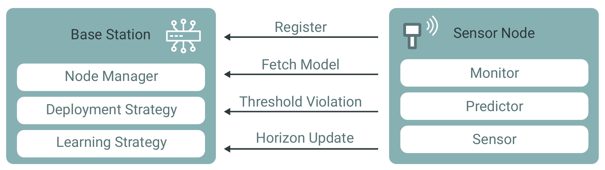

# SenseReduce

A framework for prediction-based data reduction supporting continual learning and continuous deployment of TensorFlow
prediction models in IoT environments.

Minimum Supported Python Version: 3.9

## Architectural Overview



The repository consists of multiple smaller modules:

- `base`: comprises the base station logic, including model training
- `common`: shared functionality between sensor nodes and base station
- `sensor`: code for sensor nodes
- `simulation`: Jupyter notebooks for running simulations with the framework

### Known Limitations

The framework targets two-dimensional time series data. Sequential image data is not supported. However, predictions
with more than one target attribute (e.g., predicting temperature *and* humidity simultaneously) are possible.

## Contributing

The repository contains multiple TODOs in the source code that would be open for any contribution and are not reflected
in the form of Github issues (yet). If you have an idea for further improvement, please open an issue to discuss it in
detail. In case you want to contribute directly, open a pull request, and we will review it as soon as possible.

## Parameter Study

The [simulation](simulation) directory contains the jupyter notebooks required to reproduce the parameter study from our
paper. First, download the datasets from ZAMG datahub using the provided script:

```bash
cd simulation/zamg/data
chmode +x download.sh
./download.sh
```

Then, run the jupyter notebooks to preprocess the data and generate the required pickle files:

1. [Vienna Dataset](simulation/zamg/zamg_vienna.ipynb)
2. [Linz Dataset](simulation/zamg/zamg_linz.ipynb)
3. optional: [Location comparison](simulation/zamg/zamg_comparison.ipynb)

Finally, run the [simulation notebook](simulation/zamg/zamg_simulations.ipynb) to compute all parameter study results
and use the [analysis](simulation/simulation_analysis.ipynb) notebook to visualize the results.

## Raspberry Pi Setup

We tested the deployment of the framework using a Raspberry Pi 3 which we configured to reduce its power consumption as
much as possible. To reduce the general power consumption of the Raspberry Pi, we completely turn off all peripherals we
do not need (USB, LAN, HDMI, Bluetooth, LEDs, etc.). We followed the steps from multiple
guides ([source1](https://raspberrypi-guide.github.io/electronics/power-consumption-tricks)
, [source2](https://core-electronics.com.au/guides/disable-features-raspberry-pi/)
, [source3](https://www.cnx-software.com/2021/12/09/raspberry-pi-zero-2-w-power-consumption/)), but there might still be
room for improvement.

First, start the `raspi-config` tool (`sudo raspi-config`), and disable the OpenGL desktop driver with full KMS
and `xcompmgr` in the "Advanced Settings". Alternatively, you can remove the line `dtoverlay=vc4-kms-v3d`
from `/boot/config.txt`. Then *append* the following lines to `/boot/config.txt`:

```text
# Turn off LEDs
dtparam=act_led_trigger=none
dtparam=act_led_activelow=off
dtparam=pwr_led_trigger=none
dtparam=pwr_led_activelow=off

# Disable Bluetooth
dtoverlay=disable-bt
```

And adapt the following settings already in the file:

```text

# Disable audio
dtparam=audio=off

# Don't load overlays for detected cameras
camera_auto_detect=0

# Don't load overlays for detected DSI displays
display_auto_detect=0
```

Finally, reboot the Raspberry and execute the following commands:

```shell
echo '1-1' | sudo tee /sys/bus/usb/drivers/usb/unbind
/usr/bin/tvservice -o 
# sudo vcgencmd display_power 0
```

To turn everything back on again apply the following commands and remove the added lines:

```shell
echo '1-1' | sudo tee /sys/bus/usb/drivers/usb/bind
/usr/bin/tvservice -p
sudo vcgencmd display_power 1
```

### Tensorflow

We need at least Tensorflow Lite v2.5 for using LSTM models. However, TensorFlow has stopped supporting Raspberry Pis
directly, and therefore we need to install it manually. Unfortunately, many available tutorials provide instructions for
installing an older version than v2.5.

The solution we used for a Raspberry Pi 4 with Raspbian OS was following the instructions from
the [Tensorflow-bin GitHub repository](https://github.com/PINTO0309/Tensorflow-bin/). After executing the instructions
shown in the [sensor's README](sensor/README.md), do the following:

```bash
sudo apt update && sudo apt upgrade
sudo apt-get install -y build-essential python3-openssl git libgpiod2 \
                        libhdf5-dev libc-ares-dev libeigen3-dev gcc gfortran libgfortran5 \
                        libatlas3-base libatlas-base-dev libopenblas-dev libopenblas-base libblas-dev \
                        liblapack-dev cython3 libatlas-base-dev openmpi-bin libopenmpi-dev python3-dev
python3 -m pip install pip --upgrade
python3 -m pip install keras_applications==1.0.8 --no-deps
python3 -m pip install keras_preprocessing==1.1.2 --no-deps
python3 -m pip install h5py==3.1.0
python3 -m pip install pybind11
python3 -m pip install -U six wheel mock

wget "https://raw.githubusercontent.com/PINTO0309/Tensorflow-bin/main/tensorflow-2.5.0-cp37-none-linux_armv7l_numpy1200_download.sh"
chmod +x tensorflow-2.5.0-cp37-none-linux_armv7l_numpy1200_download.sh 
./tensorflow-2.5.0-cp37-none-linux_armv7l_numpy1200_download.sh
python3 -m pip uninstall tensorflow
python3 -m pip install tensorflow-2.5.0-cp37-none-linux_armv7l.whl
```

After successful execution, you should have TensorFlow 2.5 up and running on your Raspberry Pi. If you still encounter
unfixable error messages, you can try manually building a TensorFlow Lite Python Wheel for your architecture.
